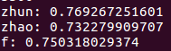

# ChineseNER
本项目使用的是python2

对命名实体识别不了解的可以先看一下<a href="https://blog.csdn.net/buppt/article/details/81180361">这篇文章</a>。

这是最简单的一个命名实体识别BiLSTM+CRF模型。

数据用的是玻森数据提供的中文命名实体识别数据，https://bosonnlp.com 这是官网，在数据下载里面有一个中文命名实体识别数据集。

先运行data_util.py处理数据，供模型使用。
然后运行pytorch或tensorflow中的train.py。
模型会保存到相应的model文件夹中，可以在训练好的模型的基础上继续训练。
## pytorch版
直接用的<a href="https://pytorch.org/tutorials/beginner/nlp/advanced_tutorial.html">pytorch tutorial</a>里的Bilstm+crf模型.

运行train.py训练即可。由于使用的是cpu，而且也没有使用batch，所以训练速度超级慢。但是pytorch比较容易上手。

## tensorflow版
运行train.py训练即可，tensorflow会自动检测并选择使用GPU或者CPU，使用的是tensorflow封装好的crf，使用了batch，训练速度比较快。

后续会增加其他修改。。

参数并没有调的太仔细。
pytorch版准确率：

tensorflow版准确率：
还没测
