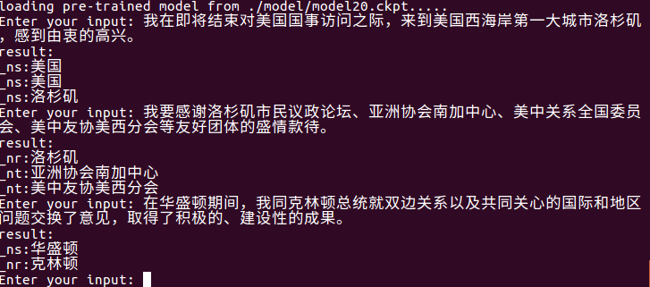
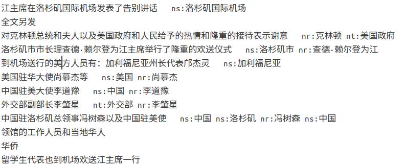

# ChineseNER
本项目使用
+ python 2.7
+ tensorflow 1.7.0
+ pytorch 0.4.0

对命名实体识别不了解的可以先看一下<a href="https://mp.weixin.qq.com/s/DUxbiVUykVSCLeYxRYd-LA" target="_blank">这篇文章</a>。顺便求star～

这是最简单的一个命名实体识别BiLSTM+CRF模型。

## 数据
data文件夹中有三个开源数据集可供使用，玻森数据 (https://bosonnlp.com) 、1998年人民日报标注数据、MSRA微软亚洲研究院开源数据。其中boson数据集有6种实体类型，人民日报语料和MSRA一般只提取人名、地名、组织名三种实体类型。

先运行数据中的python文件处理数据，供模型使用。

## tensorflow版

### 开始训练
使用 `python train.py` 开始训练，训练的模型会存到model文件夹中。

### 使用预训练的词向量
使用 `python train.py pretrained` 会使用预训练的词向量开始训练，vec.txt是在网上找的一个比较小的预训练词向量，可以参照我的代码修改使用其他更好的预训练词向量。

### 测试训练好的模型
使用 `python train.py test` 进行测试，会自动读取model文件夹中最新的模型，输入中文测试即可，测试结果好坏根据模型的准确度而定。

### 文件级别实体抽取
使用 `python train.py input_file output_file` 进行文件级实体抽取。

可以自动读取model文件夹中最新的模型，将`input_file`中的实体抽取出来写入`output_file`中。先是原句，然后是实体类型及实体（可按照需要修改）。

如 `python train.py test1.txt res.txt` , res.txt内容如下：

> 

不定期增加其他修改。。

## pytorch版
直接用的<a href="https://pytorch.org/tutorials/beginner/nlp/advanced_tutorial.html">pytorch tutorial</a>里的Bilstm+crf模型.

运行train.py训练即可。由于使用的是cpu，而且也没有使用batch，所以训练速度超级慢。想简单跑一下代码的话，建议只使用部分数据跑一下。pytorch暂时不再更新。

## 准确率
参数并没有调的太仔细，boson数据集的f值在70%~75%左右，人民日报和MSRA数据集的f值在85%~90%左右。（毕竟boson有6种实体类型，另外两个只有3种）

## 更新日志
2018-9-15 增加tensorflow版本。

2018-9-17 增加1998年人民日报数据集和MSRA微软亚洲研究院数据集。

2018-9-19 简单修改了代码风格，将model提取出来，方便以后拓展。

2018-9-22 增加 `python train.py test` 功能。

2018-10-6 增加使用参数确定是否使用预训练词向量进行训练。

2018-10-11 增加功能：可以抽取一个文本文件中的实体，写入另一个文件中。
